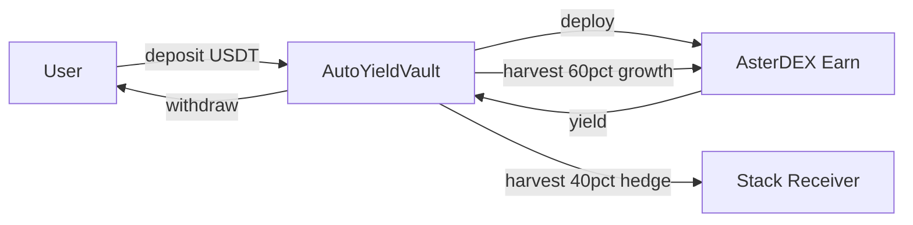

# 🤖 AutoYield Vault

> **The simplest self-driving yield engine on BNB Chain.**  
> Deposit USDT. Earn from AsterDEX. Anyone harvests. Share price grows.  
> No admin. No governance. No keys. Just yield.

[](https://github.com/manjeetsharma0796/autoyield-vault/actions/workflows/ci.yml)
[](LICENSE)
[](https://dorahacks.io/hackathon/riquid-hackathon)

---

## 🧠 What is AutoYield?

AutoYield is a **fully autonomous, non-custodial ERC-4626 yield vault** built on BNB Chain.

Users deposit **USDT** and receive **ayVAULT** shares. The vault automatically deploys all capital into [AsterDEX Earn](https://docs.asterdex.com). Anyone — literally anyone — can call `harvest()` to compound rewards back into the vault, increasing the share price for every depositor.

There is **no owner**, **no admin key**, **no governance vote** required. The protocol runs itself.

---

## ⚙️ How It Works

```
User deposits USDT
        │
        ▼
  AutoYieldVault (ERC-4626)
        │
        ▼  afterDeposit()
  AsterDEX Earn ──► Earns yield on USDT
        │
        ▼  anyone calls harvest()
  Rewards harvested
        │
        ├──► 0.1% → harvest() caller (incentive)
        │
        └──► 99.9% → redeposited into AsterDEX Earn
                         │
                         ▼
                  Share price increases 📈
                  All depositors earn proportionally
```

### Key Properties

| Property | Value |
|---|---|
| **Standard** | ERC-4626 Tokenized Vault |
| **Underlying** | USDT (BNB Chain) |
| **Yield Source** | AsterDEX Earn |
| **Admin Key** | ❌ None |
| **Governance** | ❌ None |
| **Harvest Trigger** | ✅ Anyone |
| **Harvest Cooldown** | 1 hour (anti-spam) |
| **Caller Incentive** | 0.1% of harvested rewards |
| **Chain** | BNB Chain (BSC) |

---

## 📁 Project Structure

```
autoyield-vault/
├── src/
│   ├── AutoYieldVault.sol           # Core ERC-4626 vault (no admin, harvest by anyone)
│   ├── interfaces/
│   │   └── IAsterEarn.sol          # AsterDEX Earn interface
│   └── mocks/
│       ├── MockAsterEarn.sol       # Mock for tests
│       └── MockERC20.sol            # Mock asset for tests
├── test/
│   └── AutoYieldVault.t.sol        # Foundry test suite (unit + fuzz)
├── script/
│   ├── Deploy.s.sol                # Deploy vault to BNB Chain
│   └── RunCycle.s.sol              # One-click harvest() script
├── frontend/                        # React + Vite + ethers.js dashboard
│   ├── src/
│   │   ├── App.tsx                 # Connect, deposit, withdraw, harvest
│   │   ├── config.ts               # Chain + vault address
│   │   └── abis/
│   └── package.json
├── .github/workflows/ci.yml
├── foundry.toml
└── README.md
```

## 🏛️ Architecture

Single source of truth for user funds: **AutoYieldVault** (ERC-4626). All strategy logic is on-chain and permissionless.



- **Protect:** Vault holds accounting; no owner can move funds. Only deposit/withdraw/harvest logic.
- **Automate:** `harvest()` is permissionless (anyone can call); 1h cooldown. No multisig or off-chain trigger.
- **Stack:** Optional `stackReceiver`. If set, harvested rewards split 60% back to AsterDEX Earn, 40% to the receiver (e.g. hedge vault or LP).
- **Integrate:** AsterDEX Earn is the primary yield source; BNB Chain only.

---

## 🚀 Quickstart

### Prerequisites

- [Foundry](https://book.getfoundry.sh/getting-started/installation) installed
- Git

### 1. Clone & Install

```bash
git clone https://github.com/manjeetsharma0796/autoyield-vault
cd autoyield-vault
forge install
```

### 2. Build

```bash
forge build
```

### 3. Test

```bash
forge test -vvv
```

### 4. Deploy to BNB Testnet (recommended for demo)

AsterDEX Earn is mainnet-only. On testnet we deploy **MockAsterEarn** + **AutoYieldVault** so you can run the full flow (deposit, withdraw, harvest) on BNB Testnet.

```bash
cp .env.example .env
# Set PRIVATE_KEY and BNB_TESTNET_RPC_URL

forge script script/DeployTestnet.s.sol:DeployTestnet \
  --rpc-url $BNB_TESTNET_RPC_URL \
  --broadcast \
  -vvvv
```

Then set `VAULT_ADDRESS` (and frontend `VITE_VAULT_ADDRESS`) to the printed vault address. Get testnet USDT from a [BNB testnet faucet](https://www.bnbchain.org/en/testnet-faucet), approve the vault, then deposit. To test harvest: send USDT to the deployed MockAsterEarn, call `setPendingRewards(vaultAddress, amount)` on the mock, then call `harvest()` on the vault (after 1h cooldown or warp in tests).  
**Full testnet steps:** see [scripts/README_TESTNET.md](scripts/README_TESTNET.md).

### 5. Deploy to BNB Mainnet

```bash
forge script script/Deploy.s.sol:DeployAutoYieldVault \
  --rpc-url $BNB_RPC_URL \
  --broadcast \
  --verify \
  -vvvv
```

### 6. Run a harvest cycle (anyone, one-click)

```bash
export VAULT_ADDRESS=0xYourDeployedVault
forge script script/RunCycle.s.sol:RunCycleHarvest \
  --rpc-url $BNB_RPC_URL \
  --broadcast \
  -vvvv
```

---

## 🔐 Contract Addresses (BNB Chain)

| Contract | Address |
|---|---|
| USDT (BNB Chain) | `0x55d398326f99059fF775485246999027B3197955` |
| AsterDEX Earn | `0x2F31ab8950c50080E77999fa456372f276952fD8` |
| AutoYieldVault | `TBD after deployment` |

---

## 🧪 Test Coverage

```
Running 11 tests...
[PASS] test_Deposit_MintsShares()
[PASS] test_Deposit_DeploysToAsterEarn()
[PASS] test_TotalAssets_IncludesDeployed()
[PASS] test_Withdraw_ReturnsAssets()
[PASS] test_Harvest_CompoundsRewards()
[PASS] test_Harvest_PaysCallerFee()
[PASS] test_Harvest_RevertsOnCooldown()
[PASS] test_Harvest_IncreasesSharePrice()
[PASS] test_HarvestReady_ReturnsFalseBeforeCooldown()
[PASS] test_HarvestReady_ReturnsTrueAfterCooldown()
[PASS] test_MultiUser_ProportionalYield()
[PASS] testFuzz_Deposit_Withdraw (1000 runs)
```

---

## 📖 Key Functions

### `deposit(uint256 assets, address receiver) → uint256 shares`
Deposit USDT and receive ayVAULT shares. Capital is immediately deployed to AsterDEX Earn.

### `withdraw(uint256 assets, address receiver, address owner) → uint256 shares`
Redeem ayVAULT shares for USDT. Capital is recalled from AsterDEX Earn as needed.

### `harvest()`
**Anyone can call this.** Harvests pending rewards from AsterDEX Earn, pays 0.1% to the caller as incentive, and compounds the rest — increasing share price for all depositors.

### `sharePrice() → uint256`
Returns the current price per share in USDT (18 decimals). This increases every time `harvest()` is called.

### `harvestReady() → bool`
Returns `true` if the 1-hour cooldown has passed and `harvest()` can be called.

### `pendingRewards() → uint256`
Returns the current pending rewards claimable from AsterDEX Earn.

---

## 🔒 Security Design

- **No admin keys** — The contract has no `owner`, no `onlyOwner` functions, no upgradability
- **No governance** — No votes, no timelocks, no multisigs
- **Reentrancy safe** — Inherits OpenZeppelin's battle-tested ERC-4626 implementation
- **Harvest anti-spam** — 1-hour cooldown prevents griefing
- **ERC-4626 standard** — Interoperable with any DeFi protocol that supports the standard
- **SafeERC20** — All token transfers use OpenZeppelin's SafeERC20

---

## 🏗️ Built With

- [Solidity 0.8.24](https://soliditylang.org/)
- [OpenZeppelin Contracts v5](https://github.com/OpenZeppelin/openzeppelin-contracts)
- [Foundry](https://book.getfoundry.sh/)
- [AsterDEX Earn](https://docs.asterdex.com/) on BNB Chain

---

## 📜 Design Philosophy

- **Why non-custodial:** Users retain full ownership via ERC-4626 shares. The contract cannot be upgraded or paused; no admin key exists. Trust is minimized to the code.
- **Why fully on-chain:** Every action (deposit, withdraw, harvest) is a normal transaction. No keeper bots, no multisig execution. Anyone can trigger harvest; the 0.1% caller fee incentivizes it without giving control to a single party.
- **Hedging and stacking:** The optional 60/40 split (growth vs hedge) lets yield be re-deployed: 60% compounds in AsterDEX Earn for upside, 40% can go to a stable buffer or another strategy (e.g. PancakeSwap) for resilience. This improves risk-adjusted returns without governance.

---

## 📋 Submission Checklist (Riquid Hackathon)

- [ ] **Code:** Private GitHub repo; share with `tggeth` and `cryptocoder0x`. Clear commit history and structure.
- [ ] **Demo video (≤3 min):** Show wallet on BNB Chain (or testnet), deposit, then trigger **Harvest** (Run cycle). Show real tx and updated UI. No slides-only.
- [ ] **README:** Problem, solution, architecture (diagram above), design philosophy, build/test/run instructions, link to demo video.
- [ ] **Eligibility:** BNB Chain; AsterDEX Earn as primary yield; no manual/multisig/off-chain execution; non-custodial.

---

## 🖥️ Frontend

```bash
cd frontend
cp .env.example .env
# Set VITE_VAULT_ADDRESS to your deployed vault
npm install && npm run dev
```

Open http://localhost:5173. Connect MetaMask to BNB Chain, then deposit, withdraw, or run **Harvest** (Run cycle).

---

## 📜 License

MIT — see [LICENSE](LICENSE)

---

## 🏆 Riquid Hackathon

Built for the **[Riquid Hackathon](https://dorahacks.io/hackathon/riquid-hackathon)** on DoraHacks.

> *"The Self-Driving Yield Engine — Composable Yield Infrastructure on BNB Chain"*

AutoYield embodies the hackathon theme perfectly:
- ✅ Fully autonomous — no manual intervention ever required
- ✅ Non-custodial — users always control their funds via ERC-4626
- ✅ AsterDEX Earn as primary yield source
- ✅ Permissionless — anyone can harvest, anyone can deposit
- ✅ Composable — standard ERC-4626 plugs into any DeFi protocol